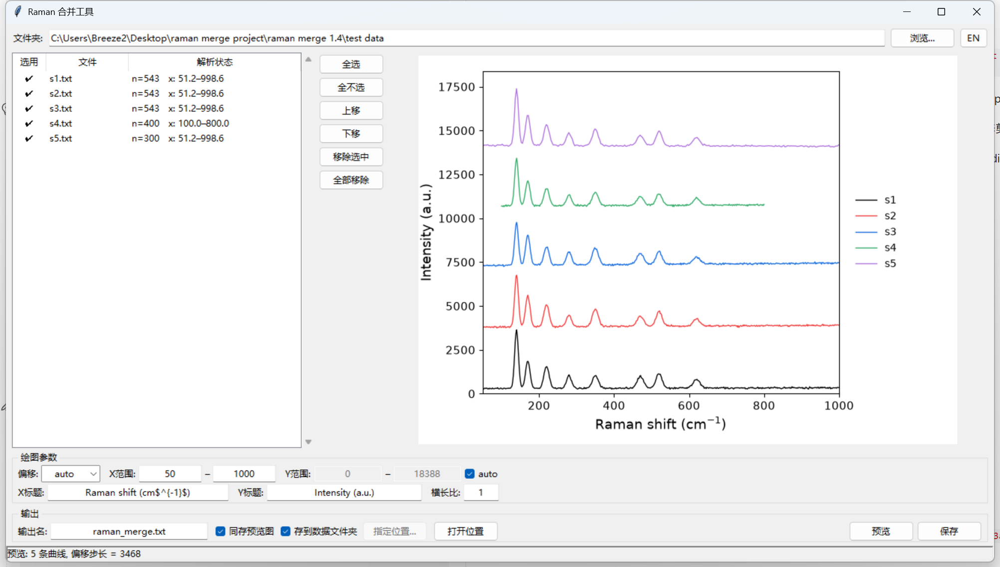
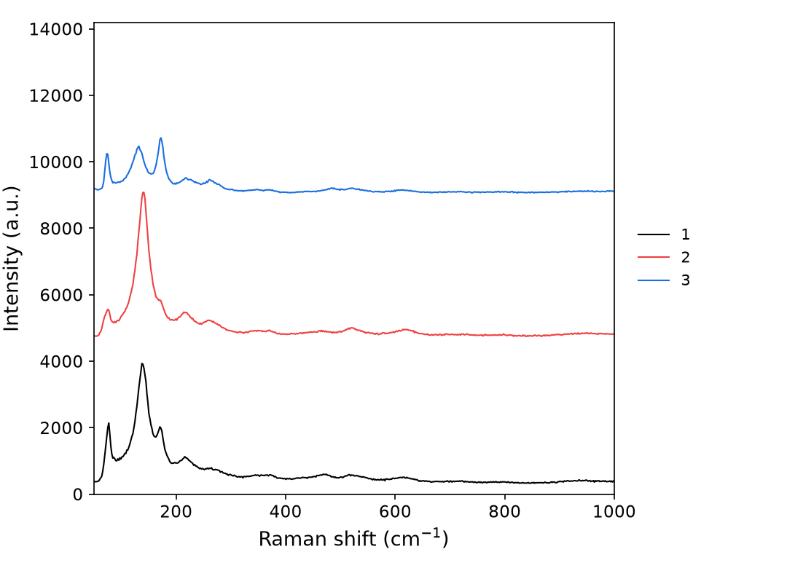

# raman2origin

快速把 Horiba LabRAM / LabSpec 导出的 Raman txt 批量整理成 **Origin 可直接绘图的多列表格**，并生成 waterfall（多线错开）预览图。带轻量化中英双语 GUI，双击即用，无需敲命令行。

Merge batch Raman txt exports (Horiba LabRAM / LabSpec) into an **Origin-ready multi-column table** with waterfall (stacked-line) preview. Ships with a lightweight bilingual (中/EN) double-click GUI — no command line required.

**v1.0.0** · [Release 页面下载 Windows 单文件 exe](https://github.com/Breeze136/raman2origin/releases)（`raman2origin-v1.0.0-win64.exe`，~30 MB，免安装、免 Python 环境）

---

## 适用场景

- **批量处理**：快速批量处理 Raman 数据（表头自动识别）并合并，直接拖入 Origin 作图——去除重复操作，专注逻辑分析
- **预览筛选**：通过预览功能快速筛选对比光谱数据，精选实际需要的数据再导入 Origin 作图；紧急情况可直接导出预览图用于汇报和展示
- **不止 Raman**：理论上支持 UV-Vis 等所有带表头的 XY 双列数据

## Use cases

- **Batch & go**: merge header-varying Raman txt exports in seconds and drag the result straight into Origin — no repetitive chores, stay focused on the analysis
- **Screen first**: compare spectra in the waterfall preview and merge only what you need; in a pinch, the exported preview PNG is ready for reports and slides
- **Beyond Raman**: works in principle with any header-bearing two-column XY data (e.g. UV-Vis)

---

## 功能特性

- **自动跳表头**：不数行号，按内容定位数据区，仪器表头行数每次不同也能正确解析
- **一键合并**：多曲线按文件名自然序（1, 2, 3 … 11, 12）合并为一个 txt——共用 X 列 + 各 Y 列，首行为样品编号（即 Origin 的 Long Name）
- **X 网格容错**：横坐标范围不一致的曲线自动追加为 `xn + 样品名` 列对（如 `x2 s4`）
- **跨文件夹自由挑选**：浏览对话框单选/多选都是**追加**（按路径自动去重），想加整个文件夹就 Ctrl+A 全选；「全部移除」一键清空重来
- **waterfall 预览**：Origin 风格（曲线纵向错开、四边黑框、图例外置右侧），偏移 `auto / 0 / 10%–200%` 下拉即选即绘，任意输入框回车即时刷新
- **坐标轴标题自定义**：X/Y 标题可改（支持成对 `$...$` 上下标），留空回退默认并跨会话记忆
- **长样品名不裁切**：图例文字再长也完整显示，画布自动加宽
- **中英双语界面**：右上角一键切换
- **Origin 友好保存**：合并时同存预览 PNG（与界面设置严格一致）；可存数据文件夹或指定目录；重名自动 `_1/_2` 编号
- **格式健壮**：小数逗号（法语区 locale）、降序 x（自动翻转）、表头混入孤立数字行、头部异常点（只剪头不剪尾）均已处理

## 界面预览

| GUI 主界面 | waterfall 预览 |
|---|---|
|  |  |

## 安装

**方式一：exe（推荐，无需 Python）** —— 从 [Releases](https://github.com/Breeze136/raman2origin/releases) 下载 `raman2origin-v1.0.0-win64.exe`，双击即用（Windows 10/11 64 位）。

**方式二：源码** —— 需要 Python 3.8+（Windows 推荐 python.org 官方版，自带 tkinter）：

```bash
pip install -r requirements.txt
```

依赖只有 `numpy` 和 `matplotlib`，GUI 用的是 Python 自带的 tkinter。

## 使用

### GUI（推荐）

Windows 双击 `raman_gui.bat`（或直接双击 exe），或：

```bash
python raman_gui.py
```

1. **浏览…**：单选/多选都**追加**到列表（可跨文件夹分批挑选，重复自动跳过）；要整个文件夹就在对话框里 **Ctrl+A 全选**。对话框默认只显示 txt，可切"所有文件"
2. 列表中**勾选 / 上移下移排序 / 移除选中 / 全部移除**，解析状态（点数、X 范围）一目了然；无法解析的文件自动不勾选
3. 点**预览**确认 waterfall 效果：偏移下拉 `auto / 0（完全重叠）/ 10%–200%`（也可手输绝对数值）；X 范围、横长比可调并记忆；Y 范围默认 auto 跟随曲线数量，取消勾选可手动覆盖；X/Y 标题可改并记忆
4. 点**保存**：默认写回数据文件夹（重名自动 `_1/_2` 编号，预览 PNG 跟随同编号）；取消"存到数据文件夹"可用"指定位置..."选固定目录，"打开位置"直接打开保存目录

### 命令行

```bash
python raman_merge.py -i ./data -o merged.txt --preview preview.png
# 可选参数：--offset auto|0|110%|3500  --xlim 50 1000  --ylim 0 20000
#           --xlabel "Raman shift (cm$^{-1}$)"  --ylabel "Intensity (a.u.)"
```

## 配合 Origin 出图（建议）

1. **导入规则存一次**：Data → Import from File → Text/CSV，把第 1 行设为 Long Name、A 列设为 X，保存为 import filter 并勾选"拖放自动应用"——之后把 merged txt 拖进 Origin 即成型
2. **图形样式存一次**：画好一张精修图后右键图窗标题栏 File → Save Template As，保存为模板
3. **日常**：merged txt直接拖入origin → 全选 → Plot (→ Templates → User → 你的模板)，30 秒出图
4. **现成模板**：已附 [Raman waterfall.otpu](Raman%20waterfall.otpu)（Origin 2022 图形模板）——双击导入 Origin，保存图形样式到用户模板库后，选中合并数据的列 → Plot → My Templates → **Raman waterfall**，导入即出堆叠图 / *A ready-made Origin waterfall template (2022) ships with this repo — double-click to install, then plot your merged columns via Plot → My Templates*

## 文件说明

| 文件 | 作用 |
|---|---|
| `raman_gui.py` | GUI 主程序（与 `raman_merge.py` 须放在同一文件夹） |
| `raman_merge.py` | 解析 / 合并 / 预览核心逻辑，也可独立命令行使用 |
| `raman_gui.bat` | Windows 双击启动器 |
| `examples/` | 示例数据（LabRAM HR Evolution 导出，可直接试跑） |
| `Raman waterfall.otpu` | Origin 2024b+ 堆叠图模板，双击导入模板库即用 |


## English

**raman2origin** merges batch Raman `.txt` exports (two columns: shift, intensity) from Horiba LabRAM / LabSpec into a single Origin-ready table:

- Header auto-detection — instrument headers of any length are skipped by content, not by line count
- Natural file ordering (1, 2, 3 … 11, 12), first row = sample IDs (maps to Origin Long Name)
- Curves with mismatched X grids are appended as `xn + sample-name` column pairs (e.g. `x2 s4`)
- Pick files your way: single/multiple selections always **append** (dedup by path, batch across folders); Ctrl+A in the dialog grabs a whole folder; "Remove all" resets the list
- Waterfall (Y-offset stacked) preview in Origin style — offset `auto / 0 / 10–200%`, redraw on Enter, custom axis titles with `$...$` support, long legend names never clipped (canvas auto-widens)
- Bilingual 中文/English UI, one-click toggle
- Preview PNG saved alongside the merged table (exactly matching on-screen settings); duplicate output names auto-numbered `_1/_2`
- Robust to decimal commas, descending X (auto-flipped), stray numeric header lines, and head outliers (never trims the tail)

**Windows users**: grab the single-file `raman2origin-v1.0.0-win64.exe` from [Releases](https://github.com/Breeze136/raman2origin/releases) — no Python needed. From source: `pip install -r requirements.txt`, then `python raman_gui.py` (GUI) or `python raman_merge.py -h` (CLI). Dependencies: `numpy`, `matplotlib`.

## 引用

如果本工具帮到了你的研究，欢迎在论文中引用或在致谢中提及（仓库已附 `CITATION.cff`，GitHub 页面右侧可直接生成引用格式）。

## License

[MIT](LICENSE)
